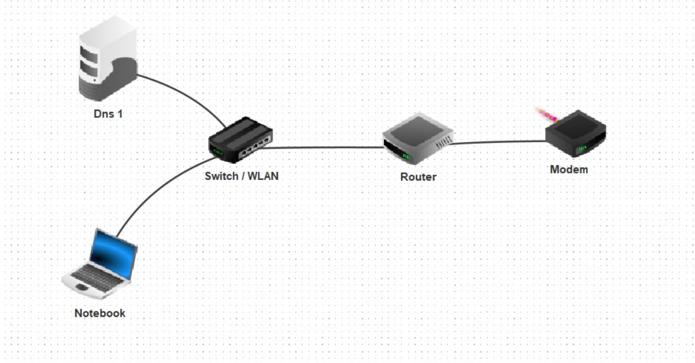

Um hier die Erklärung und paar Bilder im Folder für die Aufgabe in Fillius für die DNS Recursive/Autoritär:

Verwendestes Netz: Ohayo (Private Network von Pavkovic).

Für Netzdeteils siehe [Netzwork Doku](DNS_HÜ.md)

Netzaufbau mit DNS Pavkovic: 
Netzaufbau mit DNS Turitsov: 

Pavkovic DNS Aufbau:

**Autoritär:**

Address(A):

Host/Domain         IP-Address        

www.pavkovic.com.	10.33.29.3
ns1.turitsov.com.	10.33.32.3
ns1.pavkovic.com.	10.33.29.3

Name Server (NS):

Domain              Name Server

www.pavkovic.com.	10.33.29.3
pavkovic.com.	    ns1.pavkovic.com
turitsov.com.	    ns1.turitsov.com

**Recursive:**

Address(A):

Host/Domain     IP-Address

turitsov.com.	ns1.turitsov.com.

Name Server (NS):

Domain          Name Server

.	            dns.root. 

Turitsov:

**Recursive:**

Address(A):

Host/Domain     IP-Address

turitsov.com.	10.33.32.3
dns.root        10.33.29.3

Name Server (NS):

Domain          Name Server

.	            dns.root. 

Aus der Perspektive von **Pavkovic**

Ablauf der Aufrufung www.pavkovic.com:

Pavkovic_PC eingetragener DNS: 10.33.29.4 (Recursive von Pavkovic) --> leitet weiter zurm Autoritärn und der schickt die Webseite. (Webserver lokal auf dem Autoritärn)

Ablauf der Aufrufung turitsov.com:

Pavkovic_PC --> Pavkovic Recurisve DNS --> Autoriätr --> Turitsov DNS (webserver zeigt auf sich selber) --> Webseiten Addresse zu PC

Aus der Perspektive von **Turitsov**

Turitsov_PC --> Turitsov Recursive DNS --> Pavkovic Autoritär DNS --> Webserver auf ihm drauf schickt seine Addresse zurück